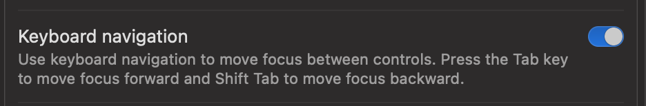

---
{"publish":true,"created":"2025-07-08T20:03:21.962-06:00","modified":"2025-07-17T14:59:44.572-06:00","tags":["a11y"],"cssclasses":""}
---

## The Problem

There are a lot of ways aria and other attributes can go wrong, so this is split into several sections itself.  Remember as a baseline:  **bad aria is worse than no aria!**

The reason is that using a role or an aria attribute will set expectations for a screen reader that you are supporting all aspects of the role / attribute correctly, and if you are not, it will be a worse experience than a somewhat janky native element that they are at least used to encountering.

## The Solution

**If you aren't sure if you should use an aria-\* attribute or a role: don't.**  Try to see if there is a native element that supports your use case first and foremost, and push back on any UX that tries to sacrifice functionality for style.

That said there are cases where it may be necessary, in which case always make sure to carefully read the [WCAG 2.2 Success Criteria](https://www.w3.org/TR/WCAG22/) and follow **all** requirements for any particular role or attribute you use.

## Specific Problem Areas
### Buttons & Links

If you have an element that you click and something happens that is not navigating you away to another page, you want to use a button.

If you have an element that you click and it navigates you away to another page or another tab view, it's an anchor tag link with a `href` even if you use Javascript to change the view instead of a full page reload.

If you have a `div` you're clicking to make something happen, why are you using a div?  There's almost no reason to do this.  You can probably restyle a `button` or anchor tag `a` to do what you want, and you should.

If for some reason you really can't use the button or anchor tag you have to be very careful to ensure you're implementing all the proper keyboard and mouse handling and every other property that would be expected of whatever role you are giving the div.
### tabindex=0

If you're tempted to use `tabindex=0` you probably are wrong.  Elements that need tab focus typically already will have support added natively in the case of buttons, links, and inputs.  If you're on a Mac and can't tab to a link you need to update Mac's setting and make sure Keyboard navigation is turned on.



You do not need to add `tabindex=0` to every bit of text in a table.  Screen readers can access table data in other ways as long as you have correctly labelled the table, rows, and columns appropriately.  Other users can read it visually.  If it's not interactable it does not need to be in the tab flow.

If you need to set programmatic focus to an element, give it `tabindex=-1` instead, which will keep it out of the tab flow but allow you to use Javascript to give it focus temporarily (mainly useful for things like modals, tabs, notifications, etc).

### disabled

There are few reasons to disable an element rather than remove it, but if you are disabling an element keep in mind that the HTML `disabled` attribute actually entirely removes it from the page for a screen reader.

That makes the information visual users get increased over what screen-reader users get, which is typically a violation of success criterion like [WCAG SC 1.3.1 Info and Relationships](https://www.w3.org/TR/WCAG22/#info-and-relationships).  Even for visual users, the lack of information around why or if an interactable element is disabled can be a problem and violate 1.3.1.

Instead, consider if the design can be altered to remove the element, and if necessary, convey the information some other way (plain text vs a readonly input).

If for some reason this cannot be done and you simply must disable the element, at least disable an element using `aria-disabled` to mark it for screen readers while keeping it focusable in the tab order and programmatically disable the function.  If you take this path note you also need to provide information to the user about *why* the element is disabled, so you likely need to implement something like an alert/modal/tooltip/info box as well.

### title

This should be used very sparingly if at all.  The main usefulness to the `title` attribute is that it provides kind of a poor-man's tooltip for mouse users only.  It is completely inaccessible to visual keyboard users, so if you need something like a tooltip you probably should just use a [[Tooltips\|(properly accessible) tooltip]].  

Additionally it's not necessary to have a title or a tooltip if a text label is already fully visible, which is the preferred way to handle labels wherever possible.
```html
<a href="some link" aria-label="Navigate to Home" title="Navigate to Home">🏠</a>
```
While in this scenario a lone emoji needs text for understanding, adding the aria-label and title are both unnecessary.  The `aria-label` alone would be sufficient for a screen reader, but still leaves mobile or keyboard users without the ability to see context.

Best solution is to just have the link text explicit: 
```html
<a href="some link">🏠 Home</a>
```